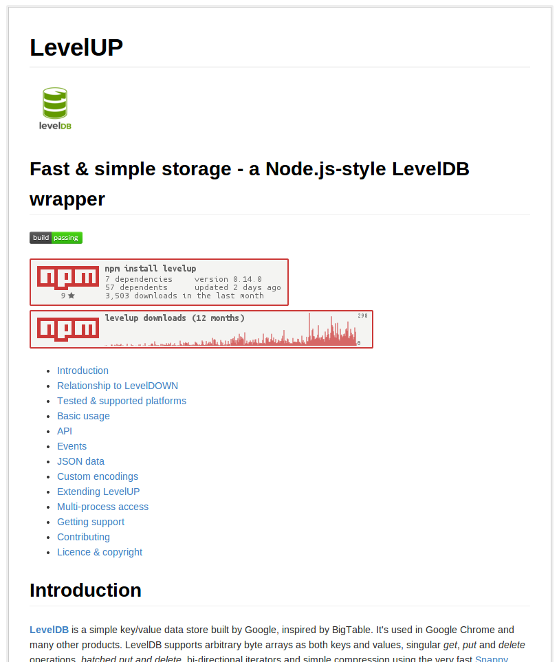

## gfm2html

```sh
$ sudo npm install gfm2html -g
$ gfm2html README.md README.html
```
Install with `npm install gfm2html -g` (you may need to `sudo` that), then you have a `gfm2html` command ready to use that will take an input file and an output file.

OR

```js
var gfm2html = require('gfm2html')

gfm2html("*hello* _markdown_", function(e,html) {
  if(e) return console.log(e.stack)
  console.log(html)
})
```

Install with `npm install gfm2html`, then you have  `gfm2html` function ready to use inline in your modules.

**Turn Markdown files into HTML**

[](https://nodei.co/npm/gfm2html/)

`gfm2html` generates an html document containing markdown that renders nearly identically to GitHub.

This library contains a default template that simply renders the markdown full screen. You are able to supply your own template and style sheet when generating a webpage. These can be passed in via the optional `opt` object of the form:

```js
{
  "template" : [HTML TEMPLATE],
  "style" : [CSS TEMPLATE]
}
```

Both templates are raw text. `[HTML TEMPLATE]` allows for variables to be inserted into the template. These variables should be defined inline in the form: `{{style}}`, `{{contents}}`, and `{{title}}`

* `{{contets}}` will be the htmlified markdown.
* `{{style}}` will be `[CSS TEMPLATE]`. We advise against changing the style template as it is the whole appeal of this library. You should re-evaluate your solution if you need to replace this style file.
* `{{title}}` is pretty verbose. It should go in the title tag.

Your supplied callback should be a function accepting two parameters: `function(e,html)` where html is the generated document from the template.


### Example

This is the [LevelUP](https://github.com/rvagg/node-levelup) README.md:



## License

**gfm2html** is Copyright (c) 2013 Rod Vagg [@rvagg](https://twitter.com/rvagg) and licenced under the MIT licence. All rights not explicitly granted in the MIT license are reserved. See the included LICENSE file for more details.
